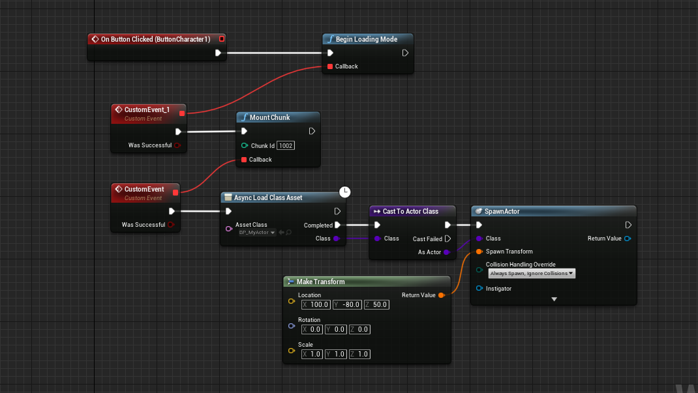

# Downloading and Loading
After creating your BuildManifest-Windows.txt manifest file upload the file & all your .pak files to your web server/CDN, here is an example of how to download/mount/load a .pak file using the plugin:

# Downloading and Spawning our Actor

This example will download all the files we previously included in our pak file “1002” and then spawn the BP_MyActor included in that folder. Note that we must also Load the Data with the “AsyncLoadClassAsset” function because all files in the .pak container is not loaded automatically for performance reasons.

You can find this example and a few more in the downloadable Example Project

