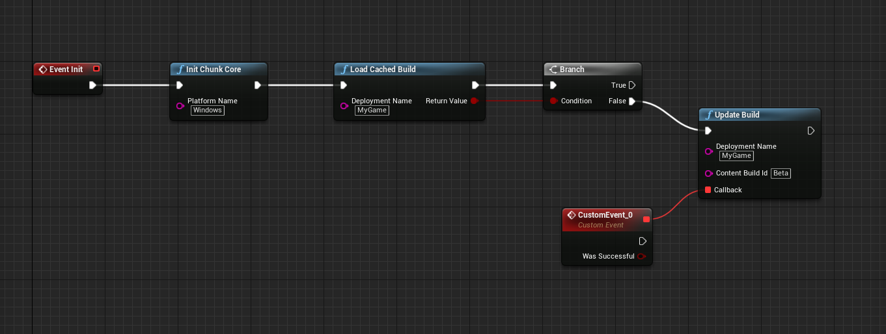
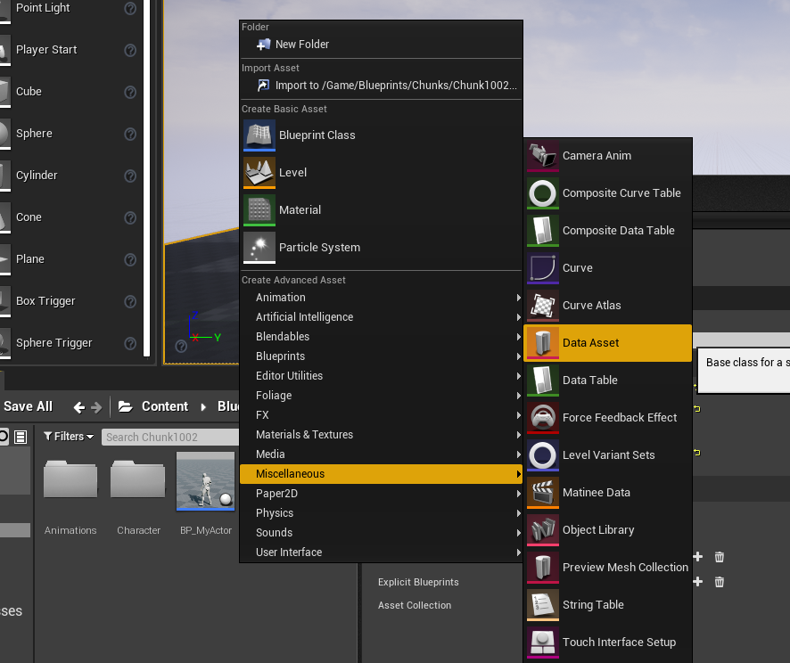
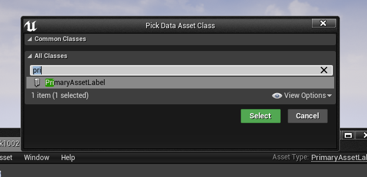
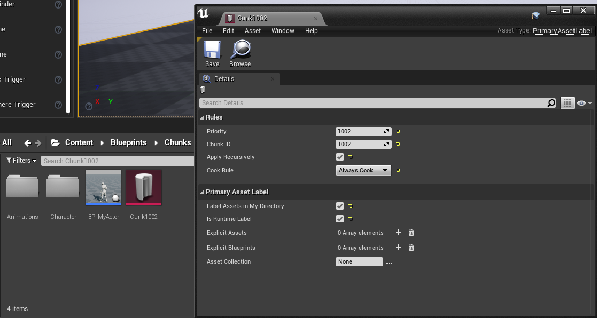

# Initializing ChunkCore
In this example we’re going to initialize using the “Windows” platform name and “MyGame” as our Deployment Name, we’re going to call this Build ID “Beta“

This means that the full path the plugin will use to find our .pak files will be:
**eeldev.com/MyGame/Beta/Windows/file.pak**

## Splitting your assets into .PAK files
- Unreal Engine makes it really easy to split your assets up into multiple .pak files, all you have to do is create a PrimaryAssetLabel file inside the directory that you want to separate from the main .pak file.
- Right click inside your content browser > Misc > Data asset

- Select the PrimaryAssetLabel type

- In this example, all files and folders that are in the same folder as the Chunk1002 file will be pacakged into it's own .pak file, and can be downloaded & loaded into memory by the chunkcore plugin.

