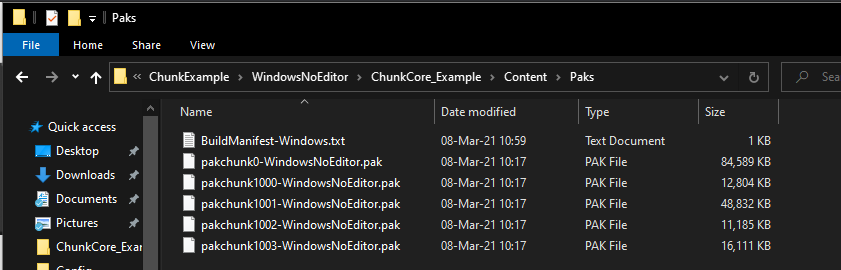
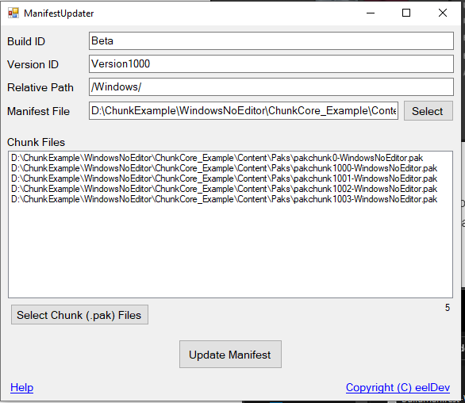

# Manifest File
To create the Manifest file needed for the plugin to know what files to download, we must first Package our game to create the needed .pak files, we must know the names and the size of the .pak files before creating our Manifest file.

https://docs.unrealengine.com/en-US/SharingAndReleasing/Patching/ChunkDownloader/LocalHost/index.html

# Packaged project example output



In this example we packaged the ChunkCore_Example project (available on github to download), then we browse into "**WindowsNoEditor\CunkCore_Example\Content\Paks**" and inside this folder we will find all of our pak files. For example you can see the 1002 file that we created earlier "**pakchunk1002-WIndowsNoEditor.pak**“.

# Manifestupdater tool
- You can download the ManifestUpdater Tool if you want to use a program rather than a text editor to Create/Update/Maintain your Manifest File.
[Download](../../../static/ManifestUpdater.7z)



- In this example we’re going to be calling our Manifest file: **BuildManifest-Windows.txt**, here’s a look at what the Example Projects Manifest file looks like:
```
$NUM_ENTRIES = 5
$BUILD_ID = Beta
pakchunk0-WindowsNoEditor.pak	        86618778	Version1000	0	/Windows/pakchunk0-WindowsNoEditor.pak
pakchunk1000-WindowsNoEditor.pak	13111168	Version1000	1000	/Windows/pakchunk1000-WindowsNoEditor.pak
pakchunk1001-WindowsNoEditor.pak	50003840	Version1000	1001	/Windows/pakchunk1001-WindowsNoEditor.pak
pakchunk1002-WindowsNoEditor.pak	11452790	Version1000	1002	/Windows/pakchunk1002-WindowsNoEditor.pak
pakchunk1003-WindowsNoEditor.pak	16497445	Version1000	1003	/Windows/pakchunk1003-WindowsNoEditor.pak
```