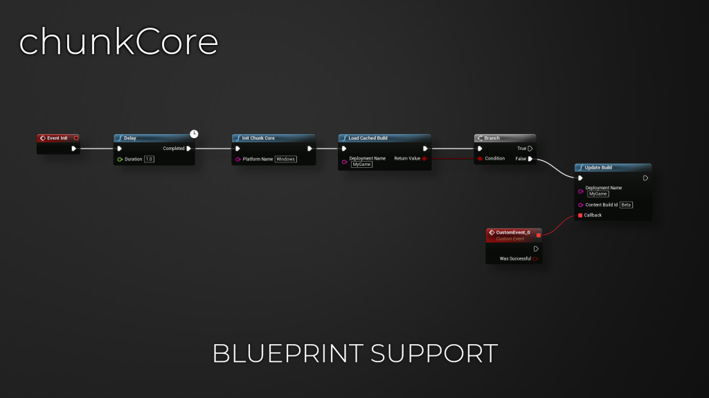

# Introduction

# ChunkCore
## What is the ChunkCore plugin?
The ChunkCore plugin is a Blueprint wrapper for the ChunkDownloader Plugin

ChunkDownloader is a patching solution for Unreal Engine. It downloads assets from a remote service and mounts them in memory for use in your games, enabling you to provide updates and assets with ease.

## REQUIREMENTS
* Unreal Engine 4.27+
* ChunkCore Plugin
* Web Server/CDN or somewhere to host your .pak files